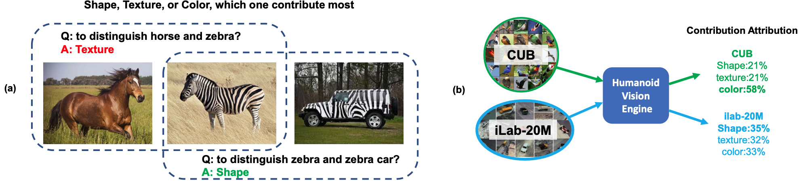
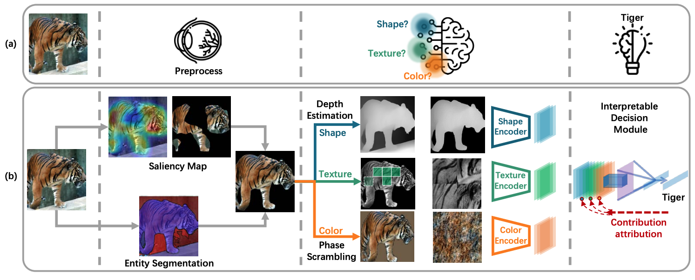

# Humanoid-Vision-Engine

[ECCV 2022] Contributions of Shape, Texture, and Color in Visual Recognition

Code is actively updating.

<div align="center">
    
</div>

**Figure:** *Left: Contributions of Shape, Texture, and Color may be different among different scenarios/tasks. 
Right: Humanoid Vision Engine takes dataset as input and summarizes how shape, texture, and color contribute to
the given recognition task in a pure learning manner (E.g., In ImageNet classification,
shape is the most discriminative feature and contributes most in visual recognition).*

<div align="center">
    
</div>

**Figure:** *Pipeline for humanoid vision engine (HVE). (a) shows how will humans’ vision
system deal with an image. After humans’ eyes perceive the object, the different parts
of the brain will be activated. The human brain will organize and summarize that
information to get a conclusion. (b) shows how we design HVE to correspond to each
part of the human’s vision system.*


## Getting Started

### Installation

- Clone this repo:
```bash
git clone https://github.com/gyhandy/Humanoid-Vision-Engine.git
cd Humanoid-Vision-Engine
```

### Datasets
- Please download the preprocessed dataset from [here](http://ilab.usc.edu/andy/dataset/hve.zip), and then unzip it place in `.data`.
  (Note: if not download automatically, please right click, copy the link and open in a new tab.)

### Analyze Dasaset Bias
1. Please train the feature models with
```bash
# train shape model
python preprocess_dataset/1_train_resnet/main.py --data data/iLab/feature_images/shape --arch data/iLab/model/shape_resnet18/
# train texture model
python preprocess_dataset/1_train_resnet/main.py --data data/iLab/feature_images/texture --arch data/iLab/model/texture_resnet18/
# train color model
python preprocess_dataset/1_train_resnet/main.py --data data/iLab/feature_images/color --arch data/iLab/model/color_resnet18/
```

2. Please train the humanoid neural network with
```
python HNN/train_HNN.py --root_shape data/iLab/feature_images/shape --root_texture data/iLab/feature_images/texture --root_color data/iLab/feature_images/color --shape_model data/iLab/model/shape_resnet18/1.pth --texture_model data/iLab/model/texture_resnet18/1.pth --color_model data/iLab/model/color_resnet18/1.pth --save_model_dir data/iLab/model/Attention)
```

3. Analyze the bias of dataset
```
python HNN/compute_bias.py --root_shape data/iLab/feature_images/shape --root_texture data/iLab/feature_images/texture --root_color data/iLab/feature_images/color --shape_model data/iLab/model/shape_resnet18/1.pth --texture_model data/iLab/model/texture_resnet18/1.pth --color_model data/iLab/model/color_resnet18/1.pth --attention_model_dir data/iLab/model/Attention/model_ck0.pth)
```

## Analyze your customized dataset

1. We need to filter the foreground with GradCam, so we need to train a model first.
```bash
python preprocess_dataset/1_train_resnet/main.py --data YOUR_DATA_ROOT --arch PATH_TO_SAVE_MODEL
```

2.  Entity segmentation
```bash
placeholder
```

3. Identify foreground. Please have a look into the code and change the arguments to your customized data.
```bash
python preprocess_dataset/2_find_foreground_with_gradcam/select_mask.py
```

4. Compute texture feature images.
```bash
python preprocess_dataset/3_compute_feature_images/generate_texture_feature.py
```

5. Run DPT to get monodepth estimation.
```bash
python preprocess_dataset/3_compute_feature_images/preprocessed_shape/DPT/run_monodepth.py
```

6. Compute shape feature images.

```bash
python preprocess_dataset/3_compute_feature_images/preprocessed_shape/generate_shape_feature.py
```

7. Compute the images that used to generate color features.

```bash
python preprocess_dataset/3_compute_feature_images/preprocess_color/FourierScrambled/generate_input.py
```

8. Use matlab to implement FourierScrambled. Matlab code path `preprocess_dataset/3_compute_feature_images/preprocess_color/FourierScrambled/main.m`.

9. After get all the feature images, you can go to part 2 and analyze the dataset bias with humanoid neural network.

---

### Imagination of HVE

Experiment of Section 5.2 "Cross Feature Imagination with HVE"

### 1. Train the Model

- In terminal, run `cd Imagine`

- Edit `script.sh`. Set the path of dataset and output file.


```bash
#!/usr/bin/env bash

FEATURE=texture # choose from texture, color, shape

python main.py --cuda 0, 1 \
               --mode train \
               --batch_size 16 \
               --dataset_path /lab/tmpig8d/u/yao_data/human_simulation_engine/V3_${FEATURE}_dataset \
               --output_path out/deeper/${FEATURE}
```      
- run `sh script.sh`

### 2. Run Generation

- Edit `test.sh`. 
    - Set the path of dataset and output file.
    - Set the test checkpoint file
    - Example
    
```bash
FEATURE=texture # choose from texture, color, shape

python main.py --cuda 0 \
               --batch_size 16 \
               --dataset_path /lab/tmpig8d/u/yao_data/human_simulation_engine/V3_${FEATURE}_dataset \
               --output_path out/deeper/${FEATURE} \
               --test_epoch 269 \

```

- run `sh test.sh`


### 2. Calculate the FID

